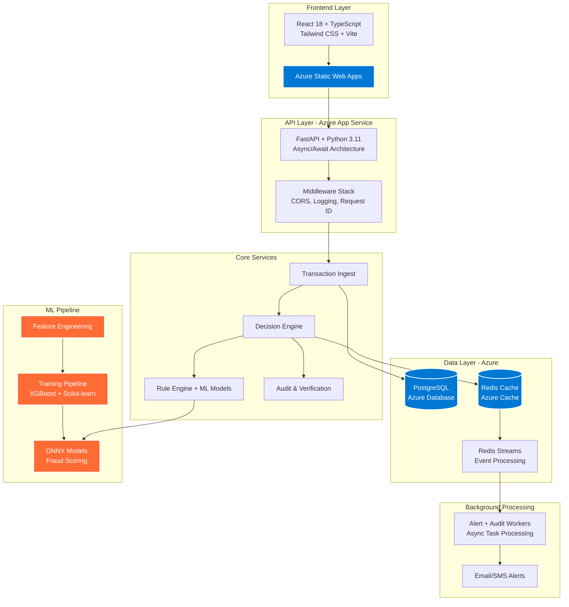

# Real-Time Fraud Detection Guard 🛡️
[](https://python.org)
[](https://fastapi.tiangolo.com)
[](https://reactjs.org)
[](https://typescriptlang.org)
[](https://postgresql.org)
[](https://redis.io)
[](https://azure.microsoft.com)
[](https://azure.microsoft.com/)
[](https://opensource.org/licenses/MIT)

> **Production-ready fraud detection system** processing transactions in real-time using ML models, business rules, and risk scoring to prevent fraudulent activities.

📊 **[Live Demo](https://drive.google.com/file/d/1yqJosEKuqZR0V5XdPcfb33kXkEQjuKAw/view?usp=sharing)** | 📋 **[Documentation](https://drive.google.com/file/d/1diOrjA_uckAZ3tuCbOqRDrFS0ELhfEpU/view?usp=sharing)** | 🔗 **[API](https://delightful-grass-0e3b7ed00.7.azurestaticapps.net)**

## 📁 Repository Structure

```
fraud-detection-guard/
├── 🎨 frontend/          # React 18 + TypeScript + Tailwind CSS
├── ⚡ backend/           # FastAPI + Python 3.11 + Async SQLAlchemy
├── 🤖 ml/               # Machine Learning Pipeline (XGBoost + ONNX)
├── 🔧 .github/          # CI/CD Workflows (Azure Deployment)
└── 📄 README.md         # Project Overview
```

## 🏗️ System Architecture



## 🚀 Key Features

- **⚡ Real-time Processing** - Sub-second transaction decisions with 99.9% uptime
- **🤖 ML-Powered Scoring** - ONNX runtime with XGBoost ensemble models
- **📏 Business Rules Engine** - Configurable rules with dynamic score adjustments
- **🔍 Multi-tier Decisions** - Approve, verify, or block with confidence scoring
- **📊 Live Dashboard** - Real-time monitoring with fraud metrics and alerts
- **🔐 Verification Workflow** - SMS/Email OTP with audit trails
- **📈 Performance Analytics** - Model accuracy tracking and system metrics
- **🌐 Enterprise Ready** - Deployed on Azure with auto-scaling

## 🛠️ Tech Stack

| Component | Technology | Purpose |
|-----------|------------|---------|
| **Frontend** | React 18 + TypeScript + Tailwind CSS | Modern responsive UI |
| **Backend** | FastAPI + Python 3.11 + Async/Await | High-performance API |
| **Database** | PostgreSQL + SQLAlchemy 2.0 | Transactional data storage |
| **Cache** | Redis + Streams | Real-time event processing |
| **ML Runtime** | ONNX + XGBoost + Scikit-learn | Fraud model inference |
| **Deployment** | Azure App Service + Static Web Apps | Cloud-native scaling |
| **CI/CD** | Azure DevOps | Automated deployments |

## 🌐 Deployment Architecture

**Production Environment: Microsoft Azure**

- **Frontend**: Azure Static Web Apps (Global CDN)
- **Backend API**: Azure App Service (Auto-scaling)
- **Database**: Azure Database for PostgreSQL (Managed)
- **Cache**: Azure Cache for Redis (High Availability)
- **Monitoring**: Azure Application Insights
- **Security**: Azure Key Vault + Managed Identity

## � Quick Start

### Prerequisites
- Python 3.11+, Node.js 20+
- PostgreSQL 13+, Redis 6+
- Azure CLI (for deployment)

### Local Development

```bash
# 1. Clone repository
git clone https://github.com/your-org/fraud-detection-guard.git
cd fraud-detection-guard

# 2. Backend setup
cd backend
pip install poetry
poetry install --with dev
cp .env.example .env  # Configure your database/redis URLs
poetry run alembic upgrade head
poetry run uvicorn app.main:app --reload

# 3. Frontend setup (new terminal)
cd frontend
npm install
cp .env.example .env  # Set VITE_API_BASE_URL
npm run dev

# 4. Access application
# Frontend: http://localhost:5173
# API Docs: http://localhost:8000/docs
```

### Production Deployment (Azure)

The system is deployed using Azure services:

1. **Azure Static Web Apps** - Frontend hosting with global CDN
2. **Azure App Service** - Backend API with auto-scaling
3. **Azure Database for PostgreSQL** - Managed database service
4. **Azure Cache for Redis** - In-memory data store

View deployment workflows in `.github/workflows/`

## � API Overview

### Core Endpoints

| Endpoint | Method | Description |
|----------|--------|-------------|
| `/api/v1/transactions/ingest` | POST | Process new transaction |
| `/api/v1/decisions/{id}` | GET | Get fraud decision |
| `/api/v1/rules` | GET/POST | Manage fraud rules |
| `/api/v1/verification/initiate` | POST | Start verification flow |
| `/api/v1/dashboard/metrics` | GET | Real-time analytics |

### Example Transaction Processing

```json
POST /api/v1/transactions/ingest
{
  "transaction_id": "txn_123456",
  "user_id": "user_789",
  "amount": 249.99,
  "currency": "USD",
  "merchant": "Example Store",
  "timestamp": "2024-01-15T14:30:00Z"
}

Response:
{
  "decision": "verify",
  "score": 75,
  "reasons": ["high_velocity", "new_device"],
  "verification_required": true
}
```

## 🧪 Testing & Quality

```bash
# Backend testing
cd backend
poetry run pytest --cov=app --cov-report=html
poetry run ruff check . && poetry run black .

# Frontend testing  
cd frontend
npm test && npm run lint && npm run typecheck
```

## 📈 Performance Targets

- **Transaction Throughput**: Designed for high-volume processing
- **Decision Latency**: Sub-second response times
- **Model Accuracy**: Continuously monitored and optimized
- **System Uptime**: Azure-backed reliability and auto-scaling

## 📄 License

This project is licensed under the MIT License - see the [LICENSE](LICENSE) file for details.


---
**⚡ Built for Fraud Prevention | Deployed on Azure Cloud**